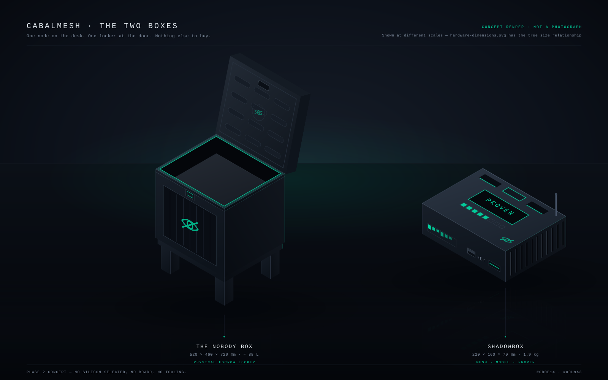
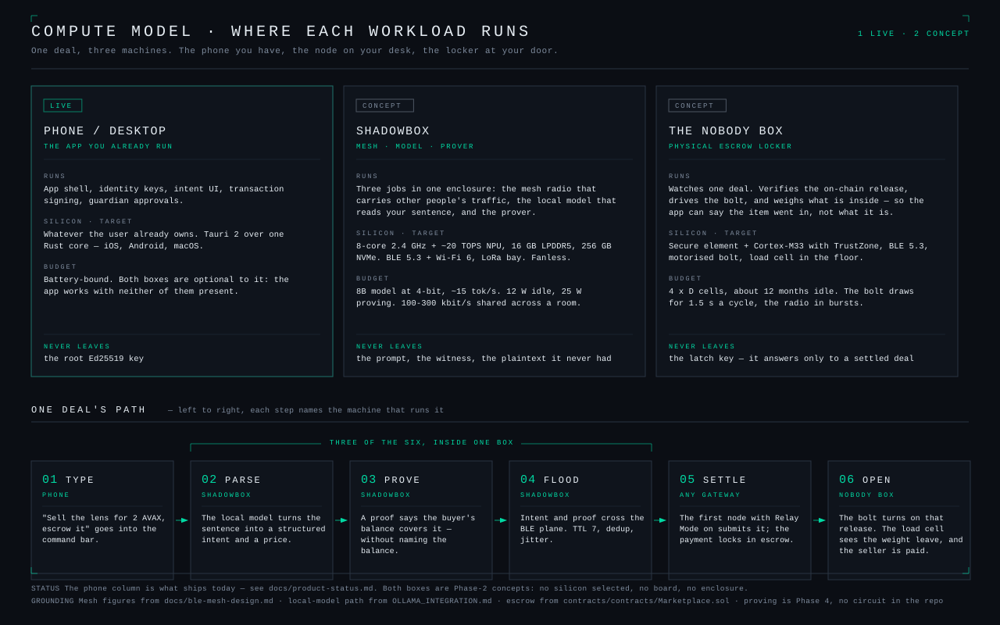
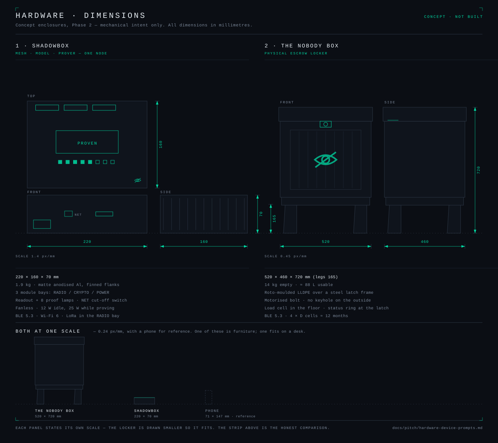

# CabalMesh hardware concepts

Two physical products for Phase 2 (Marketing, sales & hardware devices): what each one is for,
what it has to compute, how big it is, and the image prompt that renders it.

**One node on the desk. One locker at the door. Nothing else to buy.** An earlier draft of this
page had four devices — a mesh relay, a local-model box, a proving appliance, and a sealed
guardian vault. The first three were one machine pretending to be three: the same SoC, the same
enclosure problem, the same power budget, sold three times. They are now a single node, and the
vault became something a customer can actually explain to a neighbour — a delivery box that
opens when the deal settles.

Nothing here is built. No silicon is selected, no board exists, no enclosure has been tooled.
The silicon and power figures are targets chosen to make the workload plausible — a brief for a
hardware partner, not a datasheet.

Brand palette, kept across both: near-black matte chassis (`#0B0E14`), a single mint-green
accent (`#00D9A3`), no other colour, and no branding beyond a small engraved "eye-slash"
(crossed-out eye) — the same "Nobody" mark used across the deck and the app.

---

## The two devices

| | Device | Role | Keeps on the inside |
| --- | --- | --- | --- |
| 1 | **ShadowBox** | The node: mesh radio, local model, prover | The prompt, the witness, and traffic it never held in the clear |
| 2 | **The Nobody Box** | The locker: physical escrow at your door | The latch key — it answers only to a settled deal |

---

## The product, rendered



A vector render, not a photograph and not a mock-up of one: every face is projected from the
same millimetre figures the dimension sheet uses. It is the image to put in a deck or on a
landing page today — it scales to any slide size without resampling, and fixing a proportion is
a one-line edit rather than a re-roll of an image model. The two are drawn at different scales
so both stay legible; the true size relationship is in the dimension sheet's bottom strip.

The locker is drawn **open, with a parcel inside and the latch ring lit**, because that is the
whole product: the moment the deal settles, the bolt turns.

---

## Compute model



Read left to right, the diagram answers one question: *if neither box exists, what still works?*
Everything. The phone column is the product that ships today — it signs, meshes and settles on
its own. Each box moves one kind of work off the phone, and each is bought for what it keeps
rather than for the speed it adds.

| Machine | Workload | Silicon (target) | Budget |
| --- | --- | --- | --- |
| Phone / desktop — **LIVE** | App shell, identity keys, intent UI, signing, guardian approvals | Whatever the user already owns; Tauri 2 over one Rust core | Battery-bound |
| ShadowBox — *concept* | Mesh radio · local model · prover | 8-core 2.4 GHz + ~20 TOPS NPU, 16 GB LPDDR5, 256 GB NVMe, BLE 5.3 + Wi-Fi 6, LoRa bay, fanless | 8B model at 4-bit ≈ 15 tok/s; 12 W idle, 25 W proving; 100–300 kbit/s shared across a room |
| The Nobody Box — *concept* | Watches one deal, verifies the release, drives the bolt, weighs what is inside | Secure element + Cortex-M33 with TrustZone, BLE 5.3, motorised bolt, load cell | 4 × D cells ≈ 12 months idle; the bolt draws for 1.5 s a cycle |

Three of the six steps in a deal happen inside the ShadowBox — parse, prove, flood. That is the
argument for merging the three earlier devices: they were always the same three seconds of one
sentence's life.

Mesh figures come from [`docs/ble-mesh-design.md`](../ble-mesh-design.md), the local-model path
from [`OLLAMA_INTEGRATION.md`](../../OLLAMA_INTEGRATION.md), and the escrow from
[`contracts/contracts/Marketplace.sol`](../../contracts/contracts/Marketplace.sol). What ships
today is audited in [`docs/product-status.md`](../product-status.md).

**The prover is the one job with no code behind it.** The unused Noir stub was deleted on
2026-08-27, so proving is a Phase-4 commitment, not a port of something that already runs — the
box is sized for it, and that is the whole claim.

---

## Dimensions



Each panel states its own scale — one of these is furniture and one fits on a desk, so a single
sheet scale would make one of them unreadable. The strip at the bottom is the honest comparison:
both, plus a phone, at one scale.

| Device | W × D × H (mm) | Mass | Chassis | Ports |
| --- | --- | --- | --- | --- |
| ShadowBox | 220 × 160 × 70 | 1.9 kg | Matte anodised aluminium, finned flanks, 3 module bays (RADIO / CRYPTO / POWER) | USB-C PD, stub antenna, shuttered input slot. No camera, no mic, no speaker |
| The Nobody Box | 520 × 460 × 720 (legs 165) | 14 kg empty, ≈ 88 L usable | Roto-moulded LLDPE over a steel latch frame | None on the outside. No keyhole |

Both drawings live in [`assets/`](assets) as plain SVG — text, not a binary export — so a
dimension or a spec line is corrected by editing the file, and the diff shows what changed.

---

## 1. ShadowBox — the node

**What it represents:** the whole Cloak Layer in one object. It relays mesh traffic for people
it cannot read, runs the model that turns your sentence into a structured intent, and generates
the proof that says you can afford something without saying what you have. Three module bays
(RADIO / CRYPTO / POWER) mirror the in-app module system, and the `NET` switch is the privacy
claim made physical: you can see the internet is off.

**Prompt:**

```
Studio product photograph of a matte-black hardware device called "ShadowBox", a low rectangular
slab roughly 22 x 16 x 7 cm, resting at a three-quarter angle on a dark reflective black surface.
Matte anodized aluminum unibody chassis with a fine bead-blasted texture and softly chamfered
edges catching thin lines of light, no visible screws. Both side panels are deep machined
passive heat-sink fins running the full height of the case — obviously fanless, obviously
computing hard. Along the rear half of the top face, three horizontal module bay slots, each
with a thin backlit mint-green (#00D9A3) seam and a tiny embossed sans-serif label: RADIO,
CRYPTO, POWER; the middle bay has a slim dark module partially inserted, its edge glowing
mint-green. Centred on the front half of the top face, a small recessed monochrome readout of
dark grey glass showing one line of mint-green monospace text reading "PROVEN", and below it a
row of eight tiny square indicator lights set flush into the metal, five lit mint-green and
three dark. On the front face: a narrow horizontal light bar of uneven mint-green segments like
a live meter frozen mid-thought, a small machined toggle switch flicked to its off position with
a tiny engraved label reading NET beside it, and a closed metal shutter over a recessed slot,
its hairline gap glowing faintly. A single short stub antenna at the rear corner, one USB-C port
on the back edge, no other ports, no camera lens, no microphone grille. A tiny engraved
crossed-out eye icon near the front-right corner of the top face, no other logos or text.
Dramatic low-key studio lighting: one soft key light from the upper left raking across the fins,
deep black background fading to pure black, a narrow mint-green rim light along the rear
chamfer. Shallow depth of field, 85mm macro product-photography look, ultra-realistic, tack-sharp
on the readout, no dust, no fingerprints, cinematic tech-noir mood, desaturated navy-black colour
grade with exactly one saturated mint-green accent colour. No text overlays other than the
readout word and the bay labels, no other objects in frame, no people, no hands.
```

**In short:** one box that does the three jobs. Matte black metal, heat-sink fins down both
flanks, three module bays lit mint-green along the back, a small readout on top showing `PROVEN`
over eight step lamps, a thinking bar and a machined `NET` cut-off on the front, one stub
antenna. No camera, no microphone, no fan — privacy you can see rather than privacy printed on
the packaging.

---

## 2. The Nobody Box — the locker

**What it represents:** escrow you can touch. The seller drops the item in and the lid locks.
The buyer's payment locks in the Marketplace escrow on-chain. The moment that release lands, the
bolt turns and the box opens — for the buyer, and for nobody in between: not the courier, not a
neighbour, not the company that moulded the plastic. A load cell in the floor lets the box say
*something was put in* and *something was taken out* without saying what it was, which is the
same trick a ZK proof does with a number.

The obvious shape for this is the one everybody already owns: a parcel drop box on legs. It
should read as furniture at a front door, not as a safe.

**Prompt:**

```
Studio product photograph of a large matte-black parcel drop box called "the Nobody Box",
roughly 52 x 46 x 72 cm, standing on four short splayed legs on a dark reflective floor, shot
straight on and slightly above. Rotationally moulded matte-black plastic body with soft radiused
corners and a subtle orange-peel texture, a wide flat plinth rail above the legs, and a heavy
overhanging lid. The hinged lid is open and swung back past vertical, revealing the moulded
stiffening ribs on its inner face — rows of rounded recessed slots — and a dark latch mechanism
near its top edge. The rectangular opening below glows with a thin mint-green (#00D9A3) light
tracing the whole rim, and a plain grey parcel sits inside, most of the way up. The front face
carries a deep recessed panel with vertical plank grooves and, centred in it, a large engraved
crossed-out eye — no words, no brand name, no logo of any kind. Just under the lid line, a small
recessed latch block with a mint-green ring around it, lit solid. No keyhole, no handle, no
keypad, no visible fasteners anywhere on the box. Dramatic low-key studio lighting: one large
soft key light from the upper left, deep black background falling to pure black, a low mint-green
accent light grazing the floor behind the legs, the rim glow softly reflected on the floor.
Ultra-realistic studio product photography, 50mm lens, slight depth of field, cinematic tech-noir
mood, desaturated navy-black colour grade with exactly one saturated mint-green accent colour.
No text overlays, no other objects in frame, no people, no hands.
```

**In short:** a parcel drop box that is also the escrow. Matte black moulded plastic on splayed
legs, an engraved crossed-out eye where a delivery box would print `DELIVERIES`, a lid standing
open with its moulded ribs showing, a mint-green line around the opening and a parcel inside.
No keyhole, no keypad, no handle — the only thing that opens it is a settled deal.

---

## Decisions this page records

**Three devices became one.** The mesh relay, the local-model box and the proving appliance
shared a SoC class, an enclosure problem and a power budget. Selling them separately would have
meant three BOMs and three support stories for one machine. The bays keep the modularity the app
already models.

**Guardian recovery stays in the app.** The sealed cube used to hold a guardian key share; the
locker does not. Social recovery already ships on the phone
(`src/screens/GuardianApproval.tsx`), and it should not need hardware to work.

**The power-fail override is unresolved.** An outdoor box with a motorised bolt, no keyhole and
a dead battery is a locked plastic chest with someone's parcel in it. Battery life is specified
(4 × D, ≈ 12 months, low-battery warning over BLE) but the override is not, and it is the first
question a hardware partner will ask. It is a real gap, not an omission.

**The load cell claims less than it looks like.** It can say a mass arrived and a mass left. It
cannot say what the object was, and the deck must not imply otherwise.

---

## Notes for generating

- Keep both prompts on the same dark background with a single mint-green accent, so the two
  read as one product line side by side.
- They only read as a line if each keeps its own silhouette: the ShadowBox is a low finned slab
  you put on a desk, the Nobody Box is a lidded box on legs you put at a door. If a render
  drifts toward the other's proportions, re-roll it.
- If your image tool supports negative prompts, exclude: `text, logo, watermark, brand name,
  hands, people, colorful lighting, multiple colors, blue light, red light, clutter, reflections
  of a room, screws, visible ports (other than the ones described)`. For the ShadowBox add
  `camera lens, microphone, speaker grille, fan, RGB lighting`; for the Nobody Box add `keyhole,
  keypad, handle, padlock, mail slot, house numbers`.
- Aspect ratio 4:5 or 1:1 for the ShadowBox (a product card), 1:1 or 4:3 for the Nobody Box —
  it needs the floor and the open lid in frame.
- Check any finished render against [`assets/product-family.svg`](assets/product-family.svg).
  If the ShadowBox comes back with a fan grille, or the locker with a keypad, or either with a
  second accent colour, the render is off-spec — the vector version is what the dimensions and
  the feature list actually say.
- **The decks no longer wait on an image model.** All three now carry vector art cut from the
  same geometry as this page — `src/deck-shadowbox.png`, `src/deck-nobody.png` and
  `src/deck-two-boxes.png`, rasterised from the SVG beside each one. See
  [`render/README.md`](render/README.md) to regenerate.
- **The two old PNGs in [`assets/`](assets) are off-spec and unused.** `shadowbox.png` predates
  the fins, the readout and the `NET` switch; `nobody-box.png` is the sealed 6 cm cube this page
  no longer describes. A photoreal render from the prompts above would replace the vector art on
  the product cards; nothing is blocked until then.
